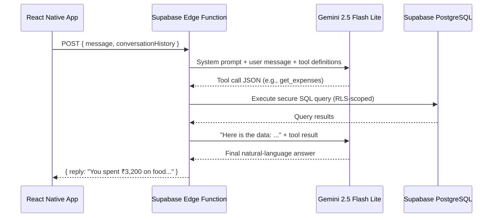

# Ask AI Feature — Final Implementation Plan

## Overview

Implement an "Ask AI" chatbot that lets users query their expense data using natural language. The system uses **Structured RAG** (LLM Tool/Function Calling) instead of vector search, ensuring accurate mathematical computations on tabular financial data.

### Architecture Flow



---

## All Decisions Finalized

| Decision | Choice |
|----------|--------|
| **LLM Provider** | Google Gemini — `gemini-2.5-flash-lite` (free tier) |
| **Entry Point** | New **bottom tab** in navigation bar (💬 "Ask AI") |
| **Chat Persistence** | Ephemeral — in-memory Zustand store (cleared on app close) |
| **API Key Storage** | Supabase Edge Function secret (NOT in project .env) |
| **Supabase CLI** | Setup steps included below |

---

## Phase 0: Supabase CLI Setup (Prerequisites)

You need the Supabase CLI to create and deploy Edge Functions. Here's how to set it up on Windows:

### Step 1: Install Supabase CLI

```powershell
# Option A: Via npm (recommended since you already have Node.js)
npm install -g supabase

# Option B: Via scoop (alternative)
scoop bucket add supabase https://github.com/supabase/scoop-bucket.git
scoop install supabase
```

### Step 2: Log in to Supabase

```powershell
supabase login
```
This opens your browser — sign in with the same account you use for the Supabase Dashboard.

### Step 3: Link to your ExpenseFlow project

```powershell
cd d:\Personal\ExpenseFlow
supabase init    # Creates the supabase/ directory structure
supabase link --project-ref plzpvzvefrwumyqrtlty
```

### Step 4: Set the Gemini API key as a secret

```powershell
supabase secrets set GEMINI_API_KEY=AIzaSy...your-key-here
```

> [!NOTE]
> After `supabase init`, a `supabase/` directory is created in your project root. This is where Edge Functions live. The `supabase/` directory should be committed to git (but NOT the `.env` files inside it).

---

## Phase 1: Backend — Supabase Edge Function

#### [NEW] `supabase/functions/ask-ai/index.ts`

Main Edge Function handler:
1. Authenticates using the user's JWT from `Authorization` header
2. Creates a Supabase client scoped to that user (RLS enforced)
3. Sends user message + tool definitions to Gemini
4. Executes tool calls against the database
5. Feeds results back to Gemini for the final answer
6. Returns the response

#### [NEW] `supabase/functions/ask-ai/tools.ts`

Tool definitions and secure executors:

| Tool | Purpose | Parameters |
|------|---------|------------|
| `get_expenses` | Fetch filtered expenses | `startDate`, `endDate`, `category` (all optional) |
| `get_spending_summary` | Aggregated totals by category | `startDate`, `endDate` |
| `get_expense_stats` | Min/max/avg/count stats | `startDate`, `endDate`, `category` |

Each executor uses parameterized Supabase queries — no raw SQL.

#### [NEW] `supabase/functions/ask-ai/prompt.ts`

System prompt instructing the LLM on behavior, date awareness, and tool usage rules.

---

## Phase 2: Frontend Service Layer

#### [NEW] [aiService.ts](file:///d:/Personal/ExpenseFlow/src/services/aiService.ts)

Thin client service that calls the Edge Function with the user's auth token.

---

## Phase 3: State Management

#### [NEW] [aiChatStore.ts](file:///d:/Personal/ExpenseFlow/src/store/aiChatStore.ts)

Zustand store for ephemeral chat state (messages array, loading, error, sendMessage, clearChat).

---

## Phase 4: Chat UI Screen

#### [NEW] [AskAiScreen.tsx](file:///d:/Personal/ExpenseFlow/src/screens/AskAiScreen.tsx)

Full-screen chat interface:
- Message bubbles (user = right/purple, AI = left/surface)
- Fixed input bar at bottom with send button
- Animated typing indicator
- Suggestion chips as empty state
- Themed consistently with existing screens

---

## Phase 5: Navigation — New Bottom Tab

#### [MODIFY] [AppNavigator.tsx](file:///d:/Personal/ExpenseFlow/src/navigation/AppNavigator.tsx)

Add "Ask AI" as a new tab in the bottom navigation bar:

```diff
 export type MainTabParamList = {
   Home: undefined;
   Monthly: undefined;
+  AskAi: undefined;
   Analytics: undefined;
   Settings: undefined;
 };
```

The tab will use a `creation` or `robot` icon from MaterialCommunityIcons, placed between Monthly and Analytics (or at the end before Settings).

---

## Phase 6: Type Definitions

#### [MODIFY] [index.ts](file:///d:/Personal/ExpenseFlow/src/types/index.ts)

Add `ChatMessage` type.

---

## Summary of All Files

| Action | File | Purpose |
|--------|------|---------|
| **NEW** | `supabase/functions/ask-ai/index.ts` | Edge Function — main orchestrator |
| **NEW** | `supabase/functions/ask-ai/tools.ts` | Tool definitions + secure query executors |
| **NEW** | `supabase/functions/ask-ai/prompt.ts` | System prompt for the LLM |
| **NEW** | `src/services/aiService.ts` | Client-side service to call Edge Function |
| **NEW** | `src/store/aiChatStore.ts` | Zustand chat store (ephemeral) |
| **NEW** | `src/screens/AskAiScreen.tsx` | Chat UI screen |
| **MODIFY** | `src/types/index.ts` | Add `ChatMessage` type |
| **MODIFY** | `src/navigation/AppNavigator.tsx` | Add "Ask AI" bottom tab |

---

## Verification Plan

### Automated Tests
- Test Edge Function locally: `supabase functions serve ask-ai --env-file supabase/.env.local`
- Curl test with valid JWT to verify tool calling + RLS
- Test each tool executor with sample queries

### Manual Verification
- End-to-end: Ask question in app → verify correct data response
- Edge cases: "What did I spend yesterday?", "My biggest expense ever", non-expense questions
- UI verification: typing indicator, error states, suggestion chips, tab navigation
