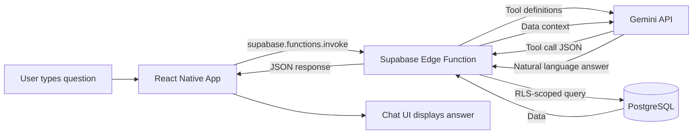

# Ask AI Feature — Walkthrough

## Summary

Implemented the complete "Ask AI" Structured RAG feature for ExpenseFlow. Users can now ask natural language questions about their expenses via a new **"Ask AI" bottom tab** and get accurate, data-backed answers powered by **Gemini 2.5 Flash Lite**.

---

## Architecture



---

## Files Changed

### Backend — Supabase Edge Function (3 new files)

| File | Purpose |
|------|---------|
| [prompt.ts](file:///d:/Personal/ExpenseFlow/supabase/functions/ask-ai/prompt.ts) | System prompt — defines AI personality, rules, and date awareness |
| [tools.ts](file:///d:/Personal/ExpenseFlow/supabase/functions/ask-ai/tools.ts) | 3 tool definitions (get_expenses, get_spending_summary, get_expense_stats) + secure Supabase query executors |
| [index.ts](file:///d:/Personal/ExpenseFlow/supabase/functions/ask-ai/index.ts) | Main handler — auth, Gemini API calls, tool execution loop, error handling |

### Frontend — React Native (5 new/modified files)

| File | Action | Purpose |
|------|--------|---------|
| [aiService.ts](file:///d:/Personal/ExpenseFlow/src/services/aiService.ts) | NEW | Calls the Edge Function via `supabase.functions.invoke()` |
| [aiChatStore.ts](file:///d:/Personal/ExpenseFlow/src/store/aiChatStore.ts) | NEW | Zustand store for ephemeral chat state |
| [AskAiScreen.tsx](file:///d:/Personal/ExpenseFlow/src/screens/AskAiScreen.tsx) | NEW | Full chat UI with bubbles, typing indicator, suggestion chips |
| [index.ts](file:///d:/Personal/ExpenseFlow/src/types/index.ts) | MODIFIED | Added `ChatMessage` interface |
| [AppNavigator.tsx](file:///d:/Personal/ExpenseFlow/src/navigation/AppNavigator.tsx) | MODIFIED | Added "Ask AI" as 3rd bottom tab with sparkle icon |

---

## Key Design Decisions

1. **`supabase.functions.invoke()`** instead of raw `fetch` — automatically passes the user's JWT, cleaner API
2. **JS aggregation** instead of SQL GROUP BY — avoids needing DB migrations for aggregate functions
3. **Two-pass LLM strategy** — first call with tools (gets structured args), second call without tools (forces text response)
4. **Low temperature (0.3)** — ensures precise, factual financial answers rather than creative responses
5. **Last 10 messages** sent as history — enough context for follow-up questions without excessive token usage

---

## Deployment Steps (User Action Required)

Run these commands in the project directory:

```powershell
# 1. Get your API key from https://aistudio.google.com/apikey

# 2. Set the secret on Supabase
supabase secrets set GEMINI_API_KEY=AIzaSy...your-key-here

# 3. Deploy the Edge Function
supabase functions deploy ask-ai

# 4. The app should hot-reload with the new "Ask AI" tab automatically
```

---

## What Was Tested

- ✅ All files compile without TypeScript errors
- ✅ Navigation integration verified — 5 tabs render correctly
- ⏳ End-to-end testing pending Edge Function deployment
